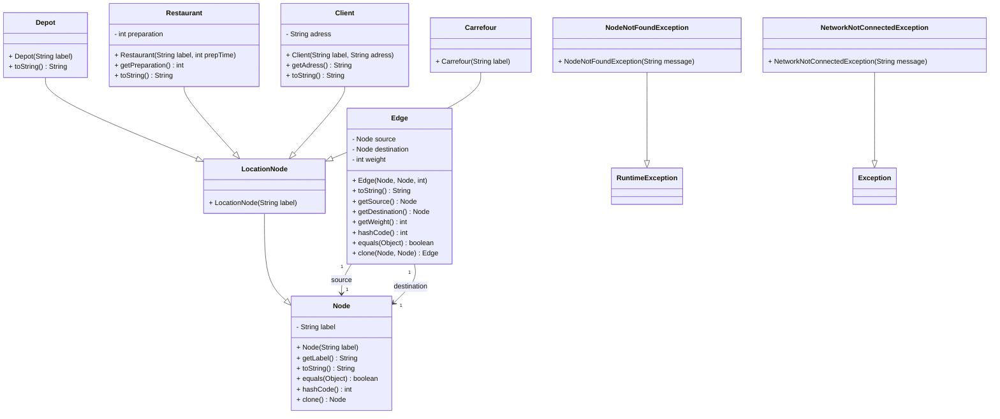
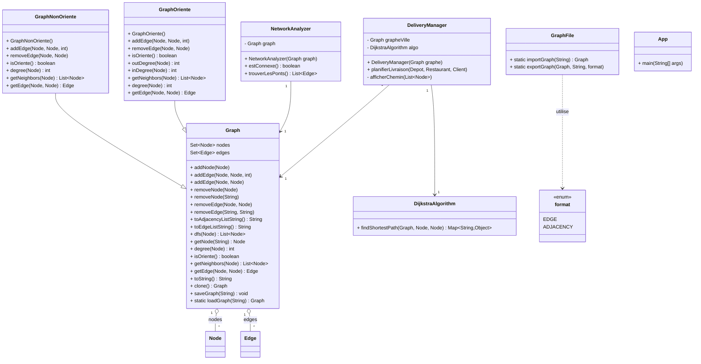

# Graph Java DEROUAULT

Ce projet a été réalisé dans le cadre des TPs de Programmation Orientée Objet (POO) en Java 
Il consiste à modéliser, implémenter et manipuler des graphes orientés ou non orientés

## Fonctionnalités
  - Création, modification et sauvegarde de graphes
  - Ajout/suppression de sommets et d’arêtes
  - Planification de livraisons (dépôts, restaurants, clients, carrefours)
  - Analyse de la connectivité et recherche de ponts dans le graphe
  - Sauvegarde et chargement des graphs, serialiser sous la forme d'une adjacency liste ou une edge Liste

## Prérequis

- Java (JDK 8 ou supérieur)

## Setup
```bash
git clone https://github.com/Pigi-bytes/Graph_Java_Derouault.git
cd Graph_Java_Derouault
```

## Compilation et exécution

Pour compiler :

```sh
javac -d bin src/*.java
```

Pour exécuter :

```sh
java -cp bin App
```

En une seule ligne :

```sh
javac -d bin src/*.java && java -cp bin App
```

## Diagramme de class interactif
Séparé en deux pour la lisibilité.




